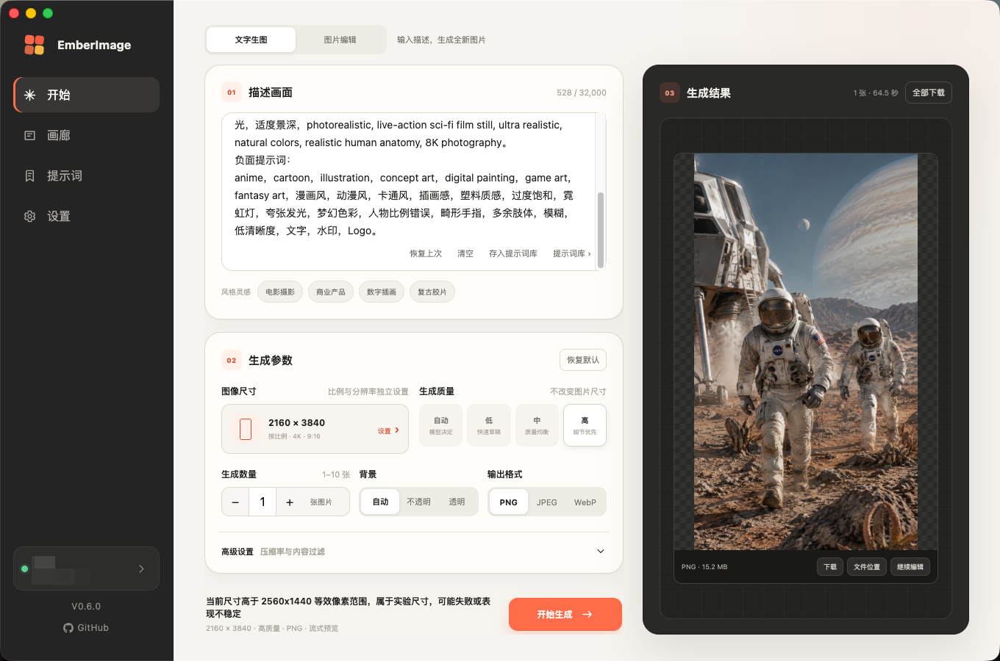
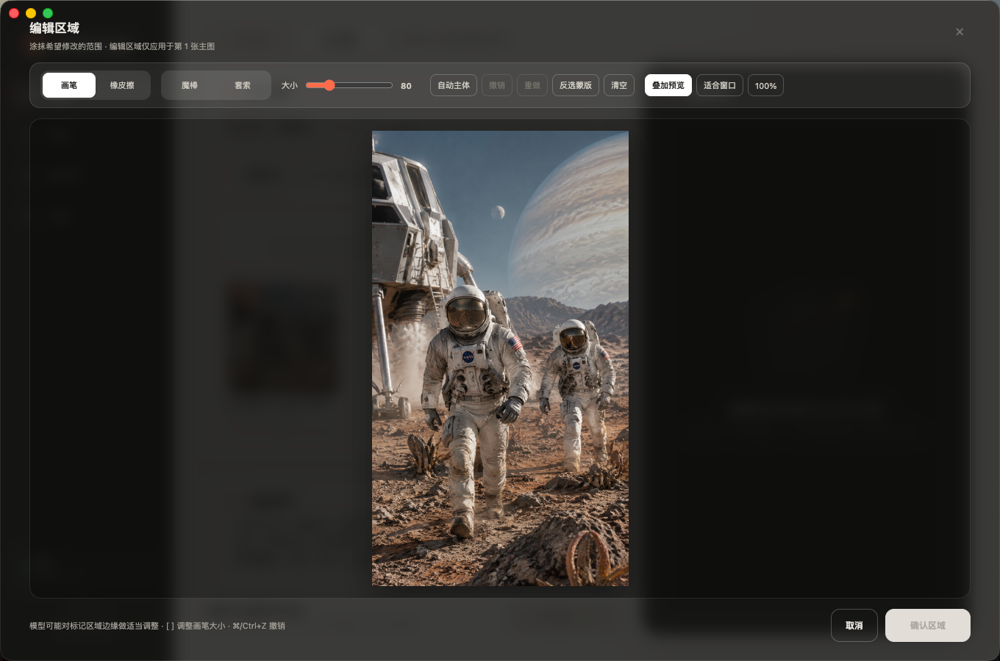
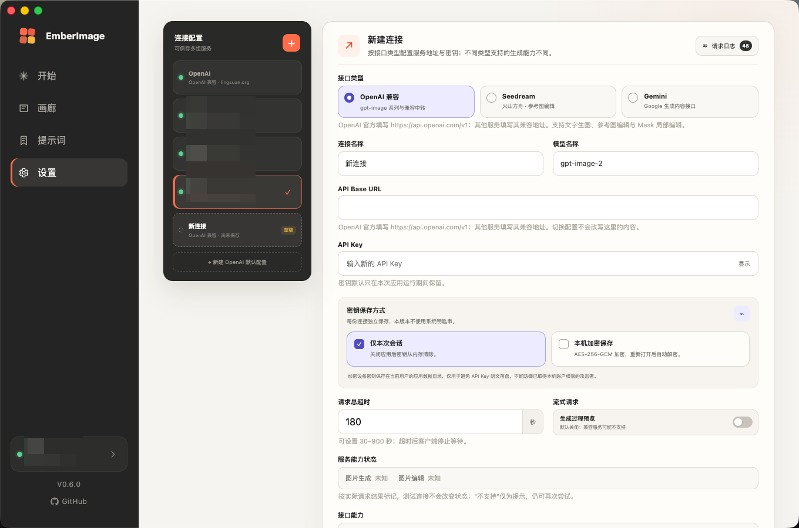

# EmberImage 🔥

> **中文版本 → [README.md](README.md)**

<p align="center">
  
  
  
  
  
  
</p>

**EmberImage** is a **local-first** desktop client for AI image generation. Bring your own API endpoint and key, then create images and edit pictures through a clean GUI — no third-party relay sits in between. Your prompts and images go **only** to the service you configured.

Built entirely with vanilla JavaScript (Electron 44, **zero runtime npm dependencies**) — no framework, no build step, lightweight and easy to audit.

---

## Feature at a glance

| Category | Highlights |
|---|---|
| 🖼️ **Text-to-image** | Custom size / ratio / quality / count / format, Base64 or URL responses, optional streaming preview |
| ✏️ **Image editing** | 1–16 reference images + natural language: redraw, restyle, add/remove elements, multi-image composition |
| 🎯 **Mask editing** | Fullscreen canvas to mark regions to change — brush, selection, auto subject, background removal; exact RGBA mask export |
| 🧰 **Selection tools** | Magic wand, lasso, auto subject, invert/feather; one-click apply as mask, worker-backed (no UI freeze) |
| 🖌️ **Background removal** | Local subject detection + transparency, feathered edges, zero API cost |
| 🗂️ **Gallery & history** | Search / favorite / reuse / batch download; edit history keeps independent input copies |
| 📌 **Prompt library** | Categories / search / pinned favorites / usage stats / batch ops / one-click round-trip |
| 🌐 **Multi-provider** | Switch **OpenAI-compatible / Seedream (Volcengine Ark) / Gemini** from one interface |
| 💬 **Multi-turn editing** | Start a session from one image and refine turn by turn: the chain mode works on all three interfaces, while Gemini's native multi-turn keeps the full history in context |
| 🔐 **Privacy-first** | Keys stay local, optional AES-256-GCM at-rest encryption; API Key never touches logs |

---

## Screenshots

<p align="center">
  
  <br><sub><b>Text-to-image</b> — the main screen: type a prompt and generate; manage history in the gallery on the right.</sub>
</p>

<p align="center">
  
  <br><sub><b>Image editing</b> — drop in reference images and edit with natural language: redraw, restyle, or compose from multiple images.</sub>
</p>

<p align="center">
  
  <br><sub><b>Multi-provider</b> — pick an interface type in the connection editor; the app pre-fills the matching endpoint, model and capability hints.</sub>
</p>

---

## Quick start

### Download

Grab the installer for your platform from the [Releases](https://github.com/lds2050/EmberImage/releases) page:

- **macOS Apple Silicon**: `EmberImage-x.x.x-arm64.dmg`
- **macOS Intel**: `EmberImage-x.x.x-x64.dmg`
- **Windows x64**: `EmberImage-x.x.x-x64.exe` (NSIS installer)

> [!NOTE]
> Installers are not signed with a commercial code-signing certificate, so macOS Gatekeeper or Windows SmartScreen may warn on first launch — always download from this repository's official Releases page.

### Run from source

Requires **Node.js 20+**:

```bash
npm install
npm start
```

Run tests and static syntax checks:

```bash
npm test
npm run check
```

---

## Getting started

1. Open **Settings → New connection**, pick an **interface type**, fill in the Base URL and API Key;
2. Go back to **Generate**, type a prompt, and hit generate;
3. To edit, switch to the **Edit** tab, drop in 1–16 reference images, and describe what to change;
4. For continuous iteration, open the **Sessions** page: start a session from a result image and refine it turn by turn.

> Tip: click "New OpenAI default" to pre-fill the official endpoint in one click. Switch between multiple saved connections from the sidebar.

---

## Capability matrix

Differences between the three interface types (also shown live in the connection editor):

| Capability | OpenAI-compatible | Seedream (Ark) | Gemini |
|---|---|---|---|
| **Text-to-image** | ✅ | ✅ | ✅ |
| **Reference-image edit** | ✅ | ✅ | ✅ |
| **Mask editing** | ✅ | ❌ | ❌ |
| **Multi-turn session · chain** | ✅ | ✅ | ✅ |
| **Multi-turn session · Gemini native** | ❌ | ❌ | ✅ |
| **Multiple images per request** | ✅ | ✅ | Serial (one by one) |
| Auth header | `Authorization: Bearer` | `Authorization: Bearer` | `x-goog-api-key` |
| Default endpoint | `api.openai.com/v1` | `ark.cn-beijing.volces.com/api/v3` | `generativelanguage.googleapis.com/v1beta` |
| Default model | `gpt-image-2.5-flare` | `doubao-seedream-4-0-250828` | `gemini-3-pro-image-preview` |

> Any relay or other OpenAI-compatible service can use the "OpenAI-compatible" type. Services that omit `/images/edits` are automatically flagged "editing not supported"; text-to-image keeps working.

---

## Features in detail

### Text-to-image

- Generates fresh images via `POST /images/generations`; model name is fully configurable;
- Sizes: auto, ratio presets (1K/2K/4K × 8 common ratios), or custom width/height with live pixel preview;
- Custom sizes are validated for multiples of 16, aspect ratio, and pixel bounds;
- Configurable quality, count, background, format, compression, and moderation level;
- Supports both Base64 and URL image responses, with optional SSE partial-image streaming (off by default);
- Full request feedback: progress, cancel, error classification, and request ID.

### Image editing

- Import 1–16 images (picker / drag-drop / paste) and describe edits in natural language;
- Drag to reorder reference cards; right-click menu for zoom preview, background removal, or removing the asset;
- JPEGs with orientation metadata (e.g. phone portraits) are auto-rotated so thumbnails match what's sent to the API;
- Results can be edited further in one click (result becomes the new primary image) or re-run with the original parameters;
- Non-PNG primaries are losslessly converted to PNG before local-edit submission; your original file is never modified.

### Multi-turn conversational editing

- Dedicated **Sessions** page: start a session from one base image, then give instructions turn by turn and iterate like a chat;
- **Chain** mode: each turn feeds the previous result back as a reference image — works on all three interfaces;
- **Gemini native multi-turn**: the full conversation history is replayed to the model (`thoughtSignature` preserved verbatim) for the most coherent context; requires a Gemini connection;
- Chat-style thread: user/result bubbles on either side, timestamps, a live countdown while generating, one-click retry on failure;
- Header chips show the model, mode, size, quality, format, and turn count at a glance;
- **Branching**: any past turn's result can be set as the new base image to explore a different direction;
- Sessions are stored locally (up to 50 sessions × 20 turns); native-mode model replies are written to disk per turn so the index stays small.

### Mask editing

- Fullscreen canvas to paint the regions you want changed: brush / eraser, undo / redo, zoom and space-drag pan;
- Shortcuts `[` `]` for brush size, `⌘/Ctrl+Z` undo, `⌘/Ctrl+Shift+Z` redo;
- One-click invert the mask to edit the complement of the painted area;
- Automatically exports the same-size RGBA mask the API expects;
- Side-by-side original/result comparison in the viewer with pixel-accurate alignment.

### Selection tools

Reach precise boundaries with selections instead of freehand, then turn a selection into the edit region with one click:

- **Magic wand**: flood-fill by color similarity, tolerance 0–128, in either "contiguous" or "global" scope;
- **Lasso**: freehand polygon outline, auto-closed on release;
- **Auto subject**: one-click heuristic selection of the main subject; oversized images are downsampled to stay responsive;
- **Shift adds / Alt subtracts**, letting you accumulate or carve out across multiple strokes;
- **Invert selection**, **feather (0–20)** for soft edges, and **clear selection**;
- **Apply as mask** (button or `Delete`): selections and painted strokes share one undo stack, mixable;
- `Esc` cancels the current selection; selection math runs in a dedicated Worker and falls back to the main thread on failure or timeout.

### Background removal

- Entry points in the asset right-click menu and the viewer's "Remove background" action;
- Detects the subject locally and makes the background transparent with feathered edges — **no API credits consumed**;
- Preview over a checkerboard, then export a transparent PNG or feed the result straight back into the asset panel.

### Gallery & history

- Card gallery with search, favorite, prompt reuse, regenerate-with-same-params, and move to trash;
- Type and input-count badges, double-click to zoom;
- Single/batch download, copy original, reveal in folder;
- Edit history stores independent copies of inputs and masks, so you can keep editing even if the originals were moved or deleted.

### Prompt library

- Dedicated prompts page: create / edit / delete, free-form text and categories with autocomplete suggestions;
- Category filter chips (with counts) and multi-keyword fuzzy search, stackable;
- Pinned favorites + usage counts — frequently used prompts float to the top;
- Batch management: multi-delete, bulk move to category, rename category (auto-merges duplicates);
- Round-trip save: store a prompt from the generate page or a gallery card in one click (auto-dedup), copy text from cards;
- Data lives locally in `prompts.json` (capped at 500 entries).

### Connections & compatibility

- Multiple independent connections, each storing name, Base URL, model, key strategy, timeout, and streaming toggle;
- Model names come with per-provider preset suggestions (OpenAI-compatible: `gpt-image-2.5-flare` / `gpt-image-2.5-sunburst` / `gpt-image-2`) while staying free-form;
- Quality supports `auto / low / medium / high / xhigh / max` — xhigh and max are new with the GPT Image 2.5 series;
- Generation/edit support is flagged from real request results (404/405 mark "unsupported" as a hint only).

---

## Keys & privacy

- **Session-only by default**: the key lives only in the Electron main process memory and is gone on quit;
- **Optional encrypted at-rest**: the API Key is encrypted with an independent random device key + AES-256-GCM and auto-decrypted on relaunch;
- The device key is stored with `0600` permissions in the user's app-data directory (no system keychain), avoiding plaintext API keys on disk;
- The API Key **never** enters generation history, image parameters, or request logs; logs keep the full prompt and other API parameters;
- Non-local endpoints must use HTTPS.

## Streaming notes

Streaming returns partial images sooner and can improve the perceived wait, and may lower the idle-connection timeout risk of some proxies; it does not shorten model time nor guarantee avoiding a server-side timeout — so each connection still keeps an independent 30–900 s request timeout, and streaming is off by default.

If a compatible service returns a specific 400 for "streaming + partial images" (e.g. `partial_images requires stream=true`, common when a gateway strips `stream` but forwards `partial_images`), the client **auto-retries once in non-streaming mode** and notifies you — no manual toggle needed.

## Data location

EmberImage uses the OS `userData` directory. Deleting a single history entry moves its originals to the system trash; "Clear history" only clears the index and keeps the original files.

---

## Development

- Pure CJS + vanilla JS, no build step; tests run on Node's built-in `node --test`;
- Layout: `src/main` (Electron main process), `src/renderer` (UI), `src/shared` (pure logic + Provider adapters shared by both), `test` (unit + end-to-end pipeline tests);
- To add a provider: implement the unified `endpoints / headers / buildGenerationBody / buildEditBody / parseResponse` interface in `src/shared/providers/` (multi-turn sessions add `buildSessionBody / extractNativeReply`), then register it in `index.cjs`.

## Docs

- Full maintenance & release process: [`docs/RELEASING.md`](docs/RELEASING.md)
- Per-version changelogs: [`docs/releases/`](docs/releases/)
- Roadmap: [`docs/ROADMAP.md`](docs/ROADMAP.md)
- How to contribute: [`CONTRIBUTING.md`](CONTRIBUTING.md)
- License: [MIT](LICENSE)

---

## Friends

- [Linux.do](https://linux.do/) — Chinese developer community

---

<p align="center">
  <sub>Maintained by <a href="https://github.com/lds2050">lds2050</a> · Local-first · Privacy-first · 🔥</sub>
</p>
